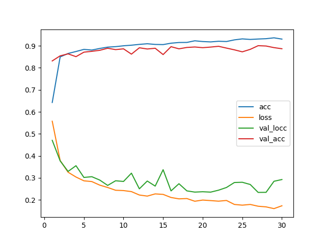
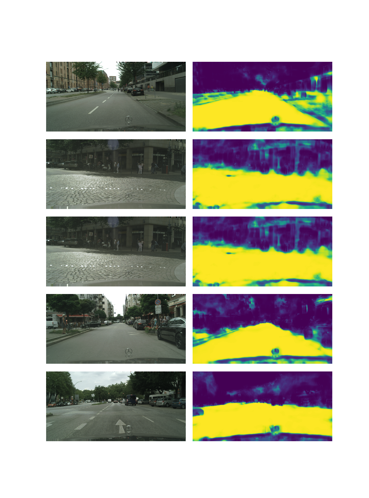

# cityscapes_single_unet_128
Arguments: Namespace(batch_size=10, crops_num=10, epochs=30, experiment_name='cityscapes_single_unet_128', model_name='cityscapes_unet_128', size=128)

# Segmentation examples

