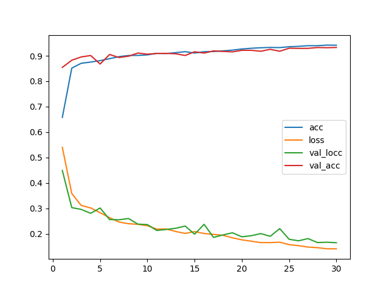
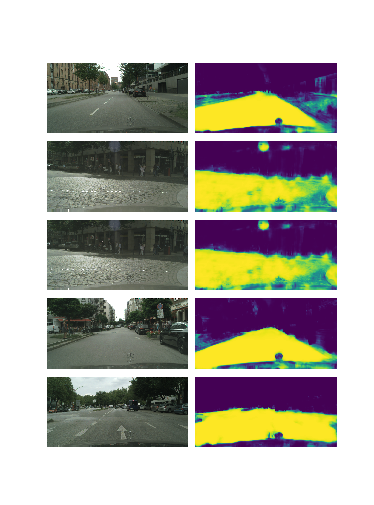

# cityscapes_single_unet_256
Arguments: Namespace(batch_size=10, crops_num=10, epochs=30, experiment_name='cityscapes_single_unet_256', model_name='cityscapes_unet_256', size=256)

# Segmentation examples

