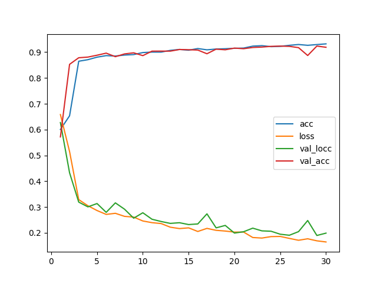
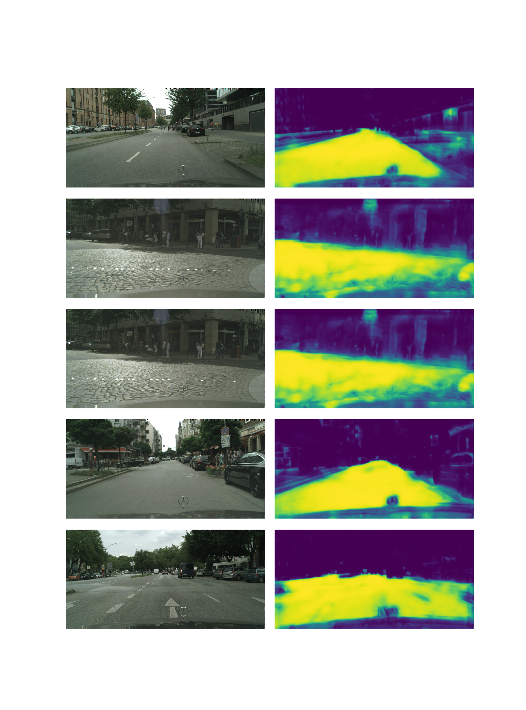

# cityscapes_single_unet_512
Arguments: Namespace(batch_size=10, crops_num=5, epochs=30, experiment_name='cityscapes_single_unet_512', model_name='cityscapes_unet_512', size=512)

# Segmentation examples

