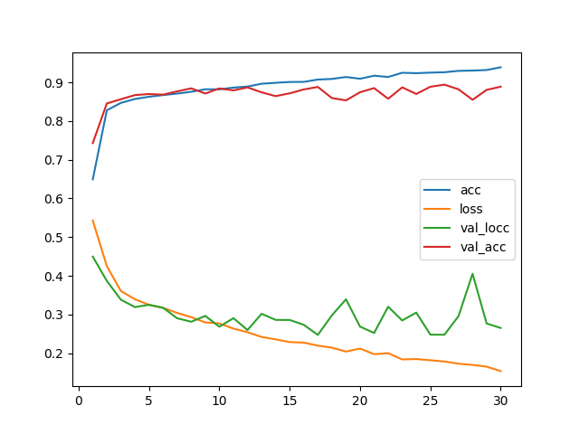
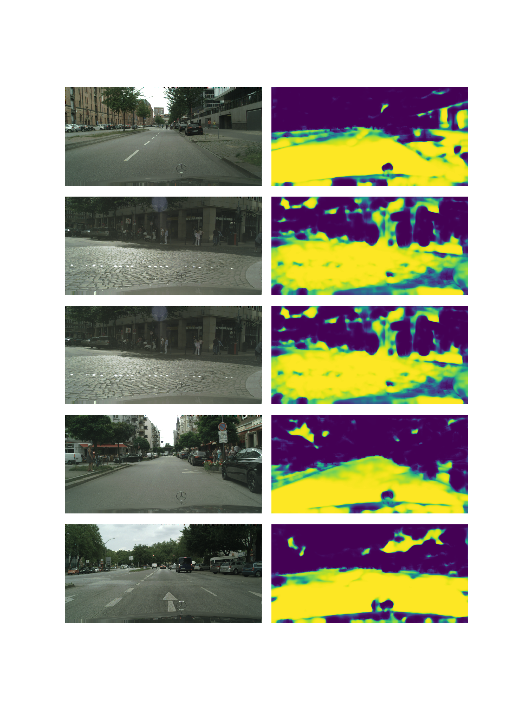

# cityscapes_single_unet_64
Arguments: Namespace(batch_size=20, crops_num=20, epochs=30, experiment_name='cityscapes_single_unet_64', model_name='cityscapes_unet_64', size=64)

# Segmentation examples

